# Muhamed Trash <a href="README.md">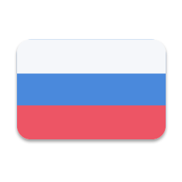</a> <a href="README_UA.md">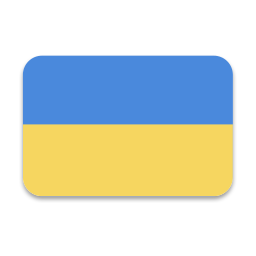</a> <a href="README_EN.md">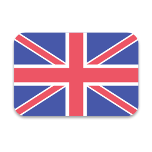</a>

Здесь собраны небольшие, но атмосферные шаблоны постов, которые помогут красиво оформить мысли, идеи и контент в стиле Muhameda. Шапки, иконки, аватарки, флажки и другие элементы для оформления этого цифрового творения.


## Shabka

Шапка Muhameda — это не просто баннер или картинка. Это атмосфера, стиль и первое впечатление о проекте. Неоновые цвета, киберпанк-настроение, минимализм и энергия цифрового мира.

| Русский | Українська | English |
|:-----------:|:-------------:|:----------:|
| 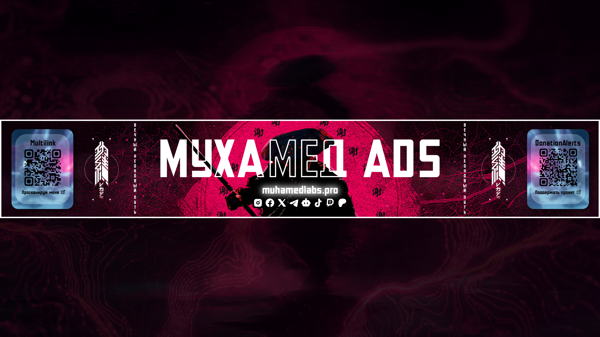 | 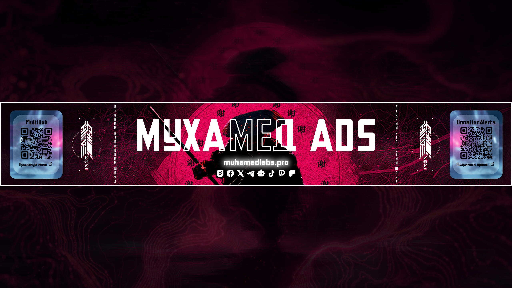 | 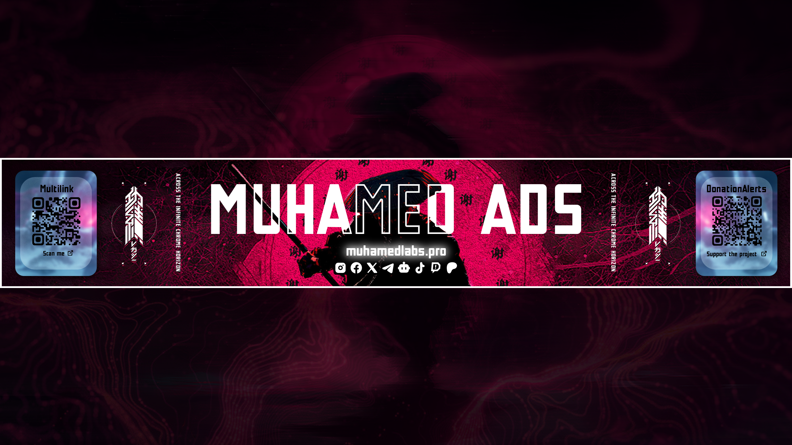 |
| 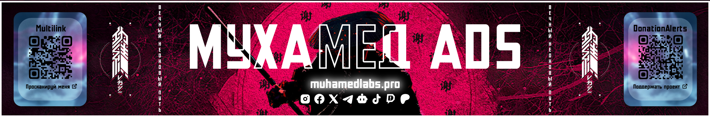 |  | 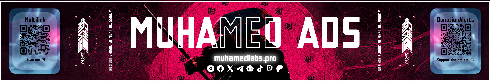 |

<details>
<summary><b>Прямые ссылки</b></summary>

<br>

**Русский**
```bash
https://raw.githubusercontent.com/muhamedlabs/MuhamedTrash/refs/heads/main/Shabka/Poster_RU.png
https://raw.githubusercontent.com/muhamedlabs/MuhamedTrash/refs/heads/main/Shabka/Postmin_RU.png
```

**Украинська**
```bash
https://raw.githubusercontent.com/muhamedlabs/MuhamedTrash/refs/heads/main/Shabka/Poster_UA.png
https://raw.githubusercontent.com/muhamedlabs/MuhamedTrash/refs/heads/main/Shabka/Postmin_UA.png
```

**English**
```bash
https://raw.githubusercontent.com/muhamedlabs/MuhamedTrash/refs/heads/main/Shabka/Poster_EN.png
https://raw.githubusercontent.com/muhamedlabs/MuhamedTrash/refs/heads/main/Shabka/Postmin_EN.png
```

</details>

---

## Flags

Флаги Muhameda — это маленькие элементы стиля, которые добавляют проекту характера и атмосферы. Они помогают оформить контент и сделать пространство Muhamed Labs более узнаваемым.

<div align="center">
  <table>
    <tr>
      <td align="center"><b>Russia</b><br></td>
      <td align="center"><b>Ukraine</b><br></td>
      <td align="center"><b>United Kingdom</b><br></td>
    </tr>
  </table>
</div>

<details>
<summary><b>Прямые ссылки</b></summary>

<br>

**Русский**
```bash
https://raw.githubusercontent.com/muhamedlabs/MuhamedTrash/refs/heads/main/Flags/Russia_flag.png
```

**Украинська**
```bash
https://raw.githubusercontent.com/muhamedlabs/MuhamedTrash/refs/heads/main/Flags/Ukraine_flag.png
```

**United Kingdom**
```bash
https://raw.githubusercontent.com/muhamedlabs/MuhamedTrash/refs/heads/main/Flags/Unit_King_flag.png
```

</details>

---

## Icons

Иконки Muhameda — это детали, которые формируют стиль всего проекта. Они добавляют узнаваемости и помогают сделать контент более живым и современным.

<br>

<div align="center">
  <table>
    <tr>
      <td align="center"><b>Donat_1</b><br></td>
      <td align="center"><b>Donat_2</b><br>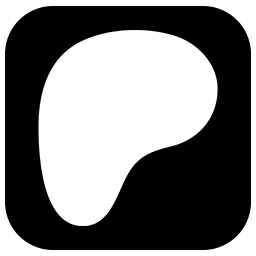</td>
      <td align="center"><b>Facebook</b><br>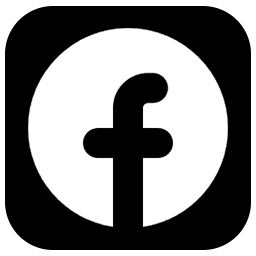</td>
      <td align="center"><b>Github</b><br>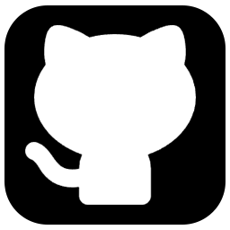</td>
      <td align="center"><b>Instagram</b><br>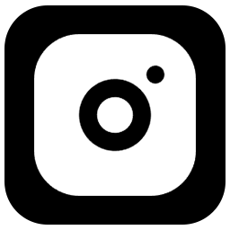</td>
      <td align="center"><b>Social_x</b><br>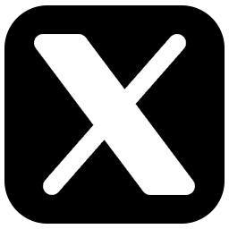</td>
      <td align="center"><b>Telegram</b><br></td>
    </tr>
  </table>
</div>

<div align="center">
  <table>
    <tr>
      <td align="center"><b>Tiktok</b><br></td>
      <td align="center"><b>Web</b><br>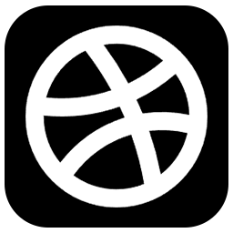</td>
      <td align="center"><b>Youtube</b><br></td>
    </tr>
  </table>
</div>

<details>
<summary><b>Прямые ссылки</b></summary>

<br>

**Donat_1**
```bash
https://raw.githubusercontent.com/muhamedlabs/MuhamedTrash/refs/heads/main/Icons/donat_1.png
```

**Donat_2**
```bash
https://raw.githubusercontent.com/muhamedlabs/MuhamedTrash/refs/heads/main/Icons/donat_2.png
```

**Facebook**
```bash
https://raw.githubusercontent.com/muhamedlabs/MuhamedTrash/refs/heads/main/Icons/facebook.png
```

**Github**
```bash
https://raw.githubusercontent.com/muhamedlabs/MuhamedTrash/refs/heads/main/Icons/github.png
```

**Instagram**
```bash
https://raw.githubusercontent.com/muhamedlabs/MuhamedTrash/refs/heads/main/Icons/instagram.png
```

**Social_x**
```bash
https://raw.githubusercontent.com/muhamedlabs/MuhamedTrash/refs/heads/main/Icons/social_x.png
```

**Telegram**
```bash
https://raw.githubusercontent.com/muhamedlabs/MuhamedTrash/refs/heads/main/Icons/telegram.png
```

**Tiktok**
```bash
https://raw.githubusercontent.com/muhamedlabs/MuhamedTrash/refs/heads/main/Icons/tiktok.png
```

**Web**
```bash
https://raw.githubusercontent.com/muhamedlabs/MuhamedTrash/refs/heads/main/Icons/web.png
```

**Youtube**
```bash
https://raw.githubusercontent.com/muhamedlabs/MuhamedTrash/refs/heads/main/Icons/youtube.png
```

</details>

---

## Avatars

Аватарки Muhameda — это лицо проекта и его настроение. Они сочетают в себе стиль, атмосферу и характер цифрового мира Muhamed Labs, помогая сделать каждый профиль, канал или сообщество более узнаваемыми и уникальными.

<div align="center">
  <table>
    <tr>
      <td align="center"><b>Muhamed_Ads</b><br>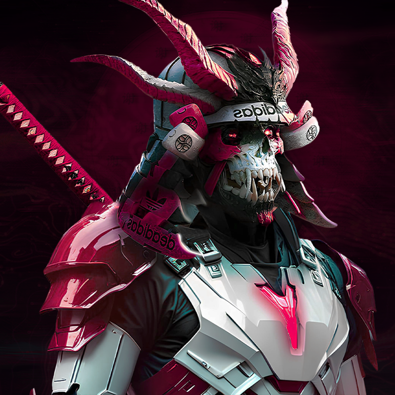</td>
      <td align="center"><b>Web</b><br>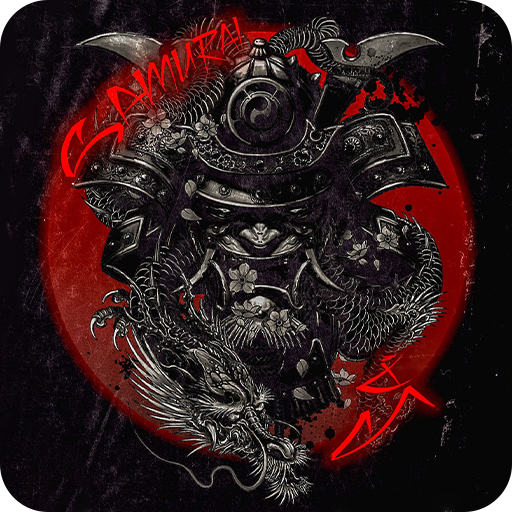</td>
      <td align="center"><b>Muhamed_IT</b><br>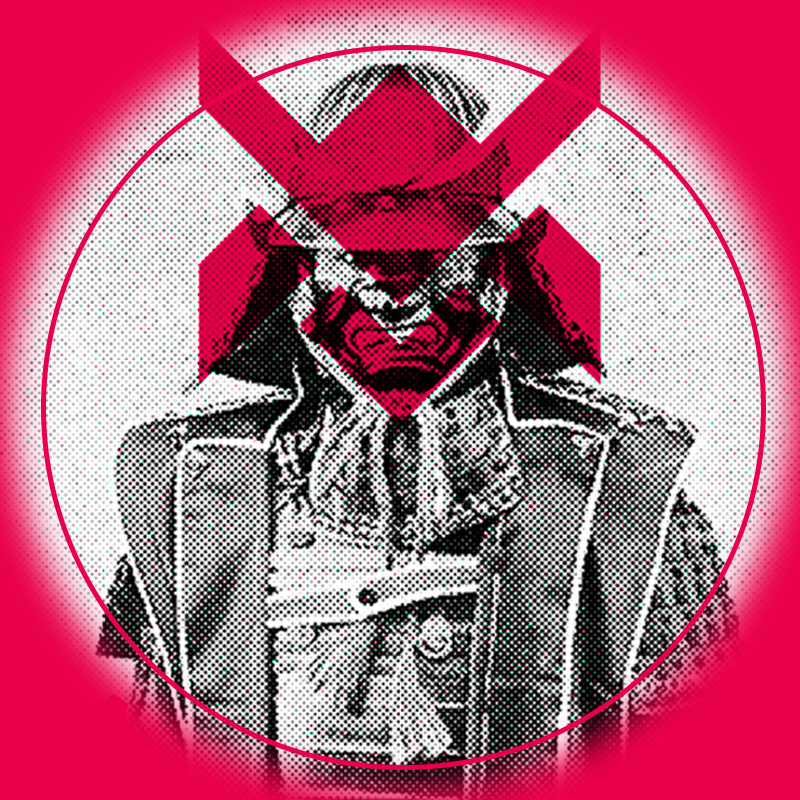</td>
      <td align="center"><b>Чат</b><br>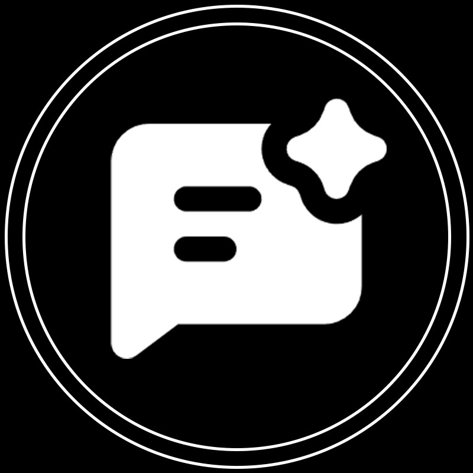</td>
    </tr>
  </table>
</div>

<details>
<summary><b>Прямые ссылки</b></summary>

<br>

**Muhamed Ads**
```bash
https://raw.githubusercontent.com/muhamedlabs/MuhamedTrash/refs/heads/main/Avatars/Muhamed_Ads.png
```

**Web**
```bash
https://raw.githubusercontent.com/muhamedlabs/MuhamedTrash/refs/heads/main/Avatars/Web.png
```

**Muhamed IT**
```bash
https://raw.githubusercontent.com/muhamedlabs/MuhamedTrash/refs/heads/main/Avatars/Muhamed_IT.png
```

**Чат**
```bash
https://raw.githubusercontent.com/muhamedlabs/MuhamedTrash/refs/heads/main/Avatars/Чат.png
```

</details>

---

## Связь и поддержка

Мы всегда открыты к общению, новым идеям и сотрудничеству. По всем вопросам обращайтесь:

- Telegram-канал: https://t.me/muhamedlabs
- Email: partners@muhamedlabs.pro
- Discord: https://discord.com/users/768782555171782667

<br>

<div align="center">
  <sub> 2023-2028 Muhamed IT  </sub>
</div>

---